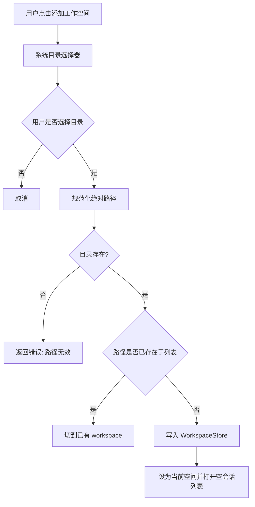
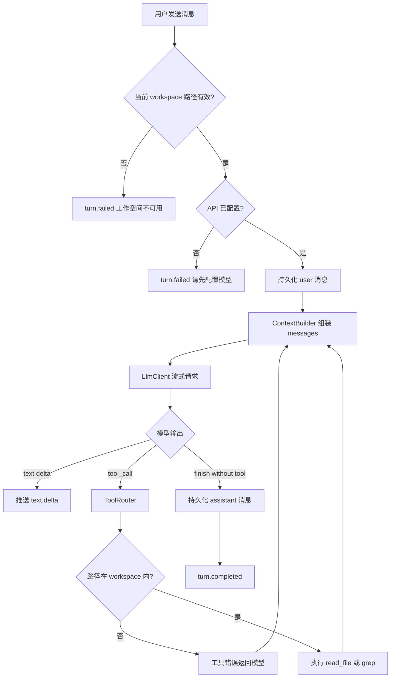

# Flux Technical Design

跨 Mac / Windows 的桌面应用：管理本地工作空间，并在选定空间内与 AI 对话。一期做成「带仓库上下文的编码助手」，骨架对齐 Codex（Core / UI 分离、Turn、工具调用），但不实现改文件、跑命令和内核沙箱。

## Reference

- **prd:** `prd.md`
- **doc:** 会话共识（精简版 Codex：工作空间 + 基于空间的 AI 对话）
- **jira_task:** N/A
- **generated_ai_td_file_path:** `td.md`

## 1. 目标与范围

### 1.1 产品目标

用户可以：

1. 添加、切换、删除本地工作空间（一个本地目录 = 一个 workspace）。
2. 在当前工作空间内进行流式 AI 对话；模型通过工具读取/搜索该目录中的文件，回答基于仓库事实，而不是泛聊天。

### 1.2 In Scope（v1）

- 多工作空间管理（添加 / 列表 / 切换 / 删除 / 校验路径仍存在）
- 每个工作空间独立会话列表与消息历史
- OpenAI 兼容 Chat Completions / Responses 流式调用
- 模型工具：`read_file`、`grep`（只读）
- 上下文组装：系统提示 + `AGENTS.md`（若存在）+ 对话历史 + 工具结果
- API 配置：`baseUrl`、`apiKey`、`model`（Key 走 OS 安全存储）
- macOS（arm64/x64）与 Windows（x64）安装包

### 1.3 Out of Scope（v1 明确不做）

- 写文件 / `apply_patch` / diff 应用
- `bash`、PTY、测试执行
- OS 内核沙箱（Seatbelt / Landlock）
- 向量索引 / embedding RAG
- 完整 IDE、LSP、多窗口编辑器
- 云端容器任务、多 Agent
- MCP Server / App Server JSON-RPC（预留接口形状，不实现独立协议进程）

后续若演进到精简 Codex，只需在现有 Agent Loop 上增加 `apply_patch`、受控 `bash` 与审批闸门，不必推翻工作空间与会话模型。

## 2. 技术栈

| 层 | 选择 | 说明 |
| --- | --- | --- |
| 桌面壳 | Electron 37+ | 工作区文件、子进程 `ripgrep`、流式 HTTP 都在主进程，比 Tauri 更贴合 Agent 演进 |
| 构建 | electron-vite | 主进程 / preload / 渲染进程分构建，TS 一体 |
| UI | React 19 + TypeScript | 聊天与工作空间管理 |
| 样式 | Tailwind CSS + shadcn/ui | 桌面端控件与暗色模式 |
| 状态 | Zustand | 当前 workspace、会话、流式消息 |
| 路由 | 单页，无浏览器路由 | 左侧栏 + 主区即可 |
| LLM | OpenAI 兼容 HTTP + SSE | 用户自备 `baseUrl` / Key；可接 OpenAI、DeepSeek、硅基流动、本地网关 |
| 检索 | ripgrep 子进程 | 不自扫 `node_modules` |
| 忽略规则 | `ignore` + `.gitignore` | 上下文与 grep 共用 |
| 持久化 | `electron-store` JSON | 工作空间与会话元数据 |
| 密钥 | `safeStorage` | 加密后写入 userData |
| 打包 | electron-builder | macOS `dmg` + Windows `nsis` |

不选 Tauri 的原因：v1 虽无 PTY，但 Agent 循环、工具执行、后续 bash 都更适合 Node 主进程。UI 不直接碰文件系统和 API Key。

## 3. 架构

```
┌─────────────────────────────────────────────┐
│ Renderer (React)                            │
│  工作空间列表 · 会话 · 流式气泡 · 设置         │
└──────────────────┬──────────────────────────┘
                   │ contextBridge IPC
┌──────────────────▼──────────────────────────┐
│ Preload                                     │
│  仅暴露白名单 API，无 Node 集成               │
└──────────────────┬──────────────────────────┘
                   │ ipcMain handle / event
┌──────────────────▼──────────────────────────┐
│ Main (Flux Core)                            │
│  WorkspaceStore · ThreadStore · AgentLoop   │
│  ToolRouter(read_file, grep) · LlmClient    │
│  ContextBuilder · SettingsStore             │
└──────────┬────────────────────┬─────────────┘
           │                    │
     本地工作区目录         OpenAI 兼容 API
```

对齐 Codex 的三点：

1. **Core 与 UI 分离**：渲染进程只发 `Op`、收 `Event`。
2. **Thread / Turn**：Thread = 一个会话；Turn = 一次用户提问到助手最终回复（中间可多轮工具调用）。
3. **工具少而硬**：v1 只有只读工具，写与执行留给后续版本。

### 3.1 进程职责

| 进程 | 允许 | 禁止 |
| --- | --- | --- |
| Main | 读工作区文件、跑 rg、调 LLM、落盘、加密 Key | 渲染 UI |
| Preload | 转发 IPC | 执行工具、读盘 |
| Renderer | 展示与输入 | `fs`、`child_process`、明文长期持有 Key |

### 3.2 目录结构

```
flux/
  prd.md
  td.md
  package.json
  electron.vite.config.ts
  src/
    shared/                 # 主进程与渲染进程共用类型，不可引用 electron
      ipc.ts
      models.ts
      events.ts
    main/
      index.ts
      ipc/register.ts
      store/workspace-store.ts
      store/thread-store.ts
      store/settings-store.ts
      agent/loop.ts
      agent/context-builder.ts
      agent/llm-client.ts
      tools/router.ts
      tools/read-file.ts
      tools/grep.ts
      workspace/ignore.ts
    preload/
      index.ts
    renderer/
      index.html
      src/
        App.tsx
        stores/app-store.ts
        pages/WorkspaceChatPage.tsx
        components/workspace/
        components/chat/
        components/settings/
        lib/ipc.ts
```

## 4. 领域模型

### 4.1 Workspace

| 字段 | 类型 | 说明 |
| --- | --- | --- |
| `id` | string (uuid) | 主键 |
| `name` | string | 默认取目录名，可改 |
| `path` | string | 绝对路径 |
| `createdAt` | number | epoch ms |
| `lastOpenedAt` | number | 切换或打开时更新 |

约束：

- `path` 必须是已存在的本地目录。
- 同一规范化路径不可重复添加（macOS 需处理 symlink / `..`）。
- 删除工作空间不删除磁盘目录；仅删除 Flux 侧记录及该空间下的会话。

### 4.2 Thread（会话）

| 字段 | 类型 | 说明 |
| --- | --- | --- |
| `id` | string | 主键 |
| `workspaceId` | string | 所属空间 |
| `title` | string | 首条用户消息截断生成，可空 |
| `createdAt` | number | |
| `updatedAt` | number | 每轮 Turn 结束更新 |

### 4.3 Message / Item

| 字段 | 类型 | 说明 |
| --- | --- | --- |
| `id` | string | |
| `threadId` | string | |
| `role` | `user` \| `assistant` \| `tool` | |
| `content` | string | 文本；工具结果也落文本 |
| `toolName` | string? | `read_file` / `grep` |
| `toolCallId` | string? | 与模型 tool call 对齐 |
| `createdAt` | number | |

Turn 进行中的流式增量不单独持久化；Turn 结束后把完整 assistant / tool 消息写入 thread store。

### 4.4 Settings

| 字段 | 存储 | 说明 |
| --- | --- | --- |
| `apiBaseUrl` | 明文 store | 默认空，需用户填 |
| `apiKey` | `safeStorage` 密文 | 渲染进程只拿「是否已配置」布尔值 |
| `model` | 明文 | 如 `gpt-4.1`、`deepseek-chat` |
| `maxContextChars` | 明文 | 默认 120_000，超限丢弃最早的 tool 结果 |

落盘位置：`app.getPath('userData')`（macOS `~/Library/Application Support/Flux`）。

## 5. IPC 契约

`src/shared/ipc.ts` 定义唯一通道。渲染进程只通过 `window.flux` 调用。

### 5.1 Invoke（请求-响应）

| 方法 | 入参 | 返回 |
| --- | --- | --- |
| `workspace.list` | — | `Workspace[]` |
| `workspace.add` | `{ path: string }` | `Workspace` |
| `workspace.remove` | `{ id: string }` | `{ ok: true }` |
| `workspace.setActive` | `{ id: string }` | `Workspace` |
| `thread.list` | `{ workspaceId: string }` | `Thread[]` |
| `thread.create` | `{ workspaceId: string }` | `Thread` |
| `thread.getMessages` | `{ threadId: string }` | `Message[]` |
| `thread.delete` | `{ threadId: string }` | `{ ok: true }` |
| `agent.submit` | `{ threadId: string; text: string }` | `{ turnId: string }` |
| `agent.abort` | `{ turnId: string }` | `{ ok: true }` |
| `settings.get` | — | `{ apiBaseUrl, model, hasApiKey, maxContextChars }` |
| `settings.update` | `{ apiBaseUrl?, apiKey?, model?, maxContextChars? }` | 同 `get`（不回传 Key） |

### 5.2 Event（主进程 → 渲染进程）

通道：`agent.event`

```ts
type AgentEvent =
  | { type: 'turn.started'; turnId: string; threadId: string }
  | { type: 'text.delta'; turnId: string; delta: string }
  | { type: 'tool.started'; turnId: string; toolName: string; args: unknown }
  | { type: 'tool.finished'; turnId: string; toolName: string; preview: string }
  | { type: 'turn.completed'; turnId: string; threadId: string }
  | { type: 'turn.failed'; turnId: string; error: string }
  | { type: 'turn.aborted'; turnId: string }
```

同一时刻每个 thread 只允许一个 in-flight Turn；重复 `submit` 返回错误，需先 `abort` 或等待结束。

## 6. 核心流程

### 6.1 添加工作空间



### 6.2 基于空间的 AI 对话（Agent Loop）



循环上限：单 Turn 最多 **12** 次工具调用，超出则插入系统提示「停止调用工具，基于已有信息作答」再请求一次；若仍要调工具则 `turn.failed`。

### 6.3 路径与忽略规则

所有工具入参路径：

1. 若相对路径，相对 `workspace.path` 解析。
2. `path.resolve` 后必须 `startsWith(workspace.path + sep)`（Windows 比较时统一大小写与分隔符）。
3. 不允许 `..` 逃逸到工作空间外。
4. 命中 `.gitignore` / `.fluxignore` 的文件：`read_file` 拒绝；`grep` 默认不搜（与 git 习惯一致）。
5. 单文件读取上限 **200 KB** 或 **4000 行**，超出截断并注明。
6. `grep` 输出最多 **50** 条，每条上下文 **2** 行，总长度上限 **32 KB**。

## 7. 上下文组装

每次请求按固定前缀顺序拼接，便于后续接 prompt cache：

1. **System**：Flux 助手角色；只能通过工具看仓库；不要编造不存在的文件；回答使用用户语言。
2. **Environment**：`workspace.path`、OS、当前日期。
3. **Project instructions**：若根目录存在 `AGENTS.md`，读入，上限 32 KiB。
4. **Tools schema**：`read_file`、`grep`。
5. **History**：该 thread 的 user / assistant / tool 消息。超 `maxContextChars` 时从最早的 tool 结果开始丢弃，保留最近 2 轮 user/assistant。

v1 不做服务端 session、不做 compact。历史过长时截断即可。

### 7.1 工具 schema

**read_file**

```json
{
  "name": "read_file",
  "description": "Read a UTF-8 text file inside the active workspace.",
  "parameters": {
    "type": "object",
    "properties": {
      "path": { "type": "string", "description": "Absolute or workspace-relative path" }
    },
    "required": ["path"]
  }
}
```

**grep**

```json
{
  "name": "grep",
  "description": "Search file contents in the workspace with ripgrep syntax.",
  "parameters": {
    "type": "object",
    "properties": {
      "pattern": { "type": "string" },
      "glob": { "type": "string", "description": "Optional glob, e.g. *.ts" }
    },
    "required": ["pattern"]
  }
}
```

## 8. LLM 客户端

- 协议：优先 **OpenAI Chat Completions** + `stream: true` + `tools`（兼容面最广）。
- Endpoint：`{apiBaseUrl}/chat/completions`（`apiBaseUrl` 允许带或不带 `/v1`，客户端归一化）。
- Header：`Authorization: Bearer {apiKey}`，`Content-Type: application/json`。
- 流式：解析 SSE `data: ` 行；`tool_calls` 增量需在客户端拼成完整 call 再执行。
- 超时：连接 30s，空闲 60s 无 chunk 则失败；用户 `abort` 取消 `AbortController`。
- 错误：4xx/5xx 把 body 摘要写入 `turn.failed`，不把 Key 打进日志。

未配置 `apiBaseUrl` 或 Key 时禁止发请求。

## 9. UI 规格

单窗口，最小 960×640。

```
┌──────────┬──────────────────────────────┐
│ 工作空间  │ 会话标题 · 模型名              │
│ 列表      ├──────────────────────────────┤
│          │ 消息流                         │
│ [+] 添加  │  user / assistant / 工具卡片    │
│          ├──────────────────────────────┤
│ 设置     │ 输入框 · 发送 · 停止            │
└──────────┴──────────────────────────────┘
```

行为：

- 启动恢复上次 `activeWorkspaceId`；路径丢失时列表标记「不可用」，禁止对话，可移除或重新添加。
- 切换工作空间只换会话列表，不中断其他空间已结束的历史。
- 工具调用在 UI 显示为折叠卡片：工具名 + 路径/pattern + 结果预览（前 20 行）。
- 设置面板：Base URL、Model、API Key（password 输入，不回显已存值）。

## 10. 安全

- `contextIsolation: true`，`nodeIntegration: false`，`sandbox: true`（渲染进程）。
- 工具不得读写工作空间外路径；不得读 `**/.env`、`**/*.pem`、`**/id_rsa`（内置拒绝列表，优先于 gitignore）。
- API Key 仅主进程解密；日志与事件中脱敏。
- v1 无命令执行，降低 RCE 面；后续加 bash 必须补审批 + 工作区可写根。

## 11. 非功能

| 项 | 指标 |
| --- | --- |
| 首屏 | 本地数据 < 100ms 可交互，不阻塞等 LLM |
| 流式 | 首 token 到达后 100ms 内反映到 UI |
| 包体 | 不内置模型；安装包仅 Electron 运行时 |
| 日志 | userData/logs，按天滚动，无 Key、无完整文件内容 |

## 12. 实现任务（依赖序）

### Task 1: Electron 工程脚手架

#### Task Summary

初始化 electron-vite + React + TS + Tailwind，打通主进程 / preload / 渲染进程空窗口，可在 macOS 与 Windows 本地 `dev`。

#### Target Modules

- `package.json` (New) - 脚本与依赖
- `electron.vite.config.ts` (New) - 三端构建
- `src/main/index.ts` (New) - 创建 `BrowserWindow`
- `src/preload/index.ts` (New) - 空 `contextBridge`
- `src/renderer/index.html` (New)
- `src/renderer/src/App.tsx` (New) - 占位布局
- `src/shared/models.ts` (New) - Workspace / Thread / Message 类型

### Task 2: IPC 白名单与 Preload API

#### Task Summary

落地 `window.flux` 类型与 `ipcMain` 注册框架，后续功能只往表里加方法，禁止临时乱开通道。

#### Target Modules

- `src/shared/ipc.ts` (New) - 通道名常量
- `src/shared/events.ts` (New) - `AgentEvent` 联合类型
- `src/main/ipc/register.ts` (New) - handle 注册
- `src/preload/index.ts` (Existing) - 暴露 `workspace` / `thread` / `agent` / `settings`
- `src/renderer/src/lib/ipc.ts` (New) - 渲染侧包装

### Task 3: 工作空间管理

#### Task Summary

实现添加/列表/切换/删除；用系统对话框选目录；路径规范化与去重；路径失效时 UI 可感知。

#### Acceptance Criteria

- 选择已存在目录后出现在列表并成为当前空间
- 重复添加同一路径不产生第二条，而是激活已有项
- 删除只清 Flux 数据，磁盘目录仍在
- 目录被删后再次打开显示不可用，不能发消息

#### Target Modules

- `src/main/store/workspace-store.ts` (New)
- `src/main/workspace/ignore.ts` (New) - 预留，本任务可只做路径规范化
- `src/renderer/src/components/workspace/WorkspaceSidebar.tsx` (New)
- `src/renderer/src/stores/app-store.ts` (New) - `workspaces` / `activeWorkspaceId`

#### Workflow

见 §6.1。

### Task 4: 会话持久化

#### Task Summary

每个工作空间可建多个 thread，消息落盘，切换空间加载对应会话；删除空间级联删除 thread。

#### Target Modules

- `src/main/store/thread-store.ts` (New)
- `src/renderer/src/components/chat/ThreadList.tsx` (New)
- `src/renderer/src/stores/app-store.ts` (Existing) - 增加 threads / messages

### Task 5: 设置与密钥存储

#### Task Summary

配置 OpenAI 兼容 API；Key 使用 `safeStorage`；设置页不回显明文 Key。

#### Acceptance Criteria

- 未配 Key 时发送消息立即失败并提示去设置
- 重启后无需重新输入 Key（本机 `safeStorage` 可用时）
- `settings.get` 永不返回明文 Key

#### Target Modules

- `src/main/store/settings-store.ts` (New)
- `src/renderer/src/components/settings/SettingsPanel.tsx` (New)

### Task 6: 只读工具 read_file / grep

#### Task Summary

在主进程实现路径沙箱、gitignore、体积上限；为 Agent Loop 提供同步/异步执行接口。

#### Target Modules

- `src/main/workspace/ignore.ts` (Existing) - 加载 `.gitignore` / `.fluxignore`
- `src/main/tools/read-file.ts` (New)
- `src/main/tools/grep.ts` (New) - spawn 打包或系统 `rg`
- `src/main/tools/router.ts` (New)

依赖：开发期可用系统 `rg`；打包阶段用 `@vscode/ripgrep` 或 vendor 二进制，在 Task 9 处理。

### Task 7: Agent Loop + LLM 流式

#### Task Summary

实现 submit → 组装上下文 → 流式调用 → 工具循环 → 完成/失败/中止；向渲染进程推送 `AgentEvent`。

#### Acceptance Criteria

- 用户消息出现后有流式助手文本
- 模型 `read_file` / `grep` 时 UI 出现工具卡片，随后继续作答
- 工作空间外路径的工具调用失败信息回到模型，不打到磁盘外
- 点击停止后不再写入后续 delta
- 单 Turn 工具次数超过 12 次按 §6.2 收束

#### Target Modules

- `src/main/agent/llm-client.ts` (New)
- `src/main/agent/context-builder.ts` (New)
- `src/main/agent/loop.ts` (New)
- `src/renderer/src/components/chat/MessageList.tsx` (New)
- `src/renderer/src/components/chat/Composer.tsx` (New)

#### Workflow

见 §6.2。

### Task 8: 聊天主界面打通

#### Task Summary

把侧栏、会话、消息、输入框、设置连成唯一主页面；处理空状态（无空间、无会话、空间不可用）。

#### Target Modules

- `src/renderer/src/pages/WorkspaceChatPage.tsx` (New)
- `src/renderer/src/App.tsx` (Existing) - 挂主页面与全局快捷键（Enter 发送、Esc 停止）

### Task 9: 打包与双端构建

#### Task Summary

electron-builder 产出 macOS dmg 与 Windows nsis；dev/prod 加载 renderer 正确；附带 rg 二进制。

#### Target Modules

- `electron-builder.yml` (New)
- `.github/workflows/build.yml` (New) - 可选 CI
- `package.json` (Existing) - `build` / `dist` 脚本

## 13. 风险与默认决策

| 点 | 决策 | 理由 |
| --- | --- | --- |
| 对话是否改代码 | v1 否 | PRD 仅「基于空间进行 AI 对话」 |
| 上下文策略 | 工具检索，不做向量库 | 实现短、路径与 Codex 一致 |
| 模型供应商 | 用户自备兼容 API | 避免绑定账单与账号体系 |
| 无 `AGENTS.md` | 仅用通用 system prompt | 仓库零配置可用 |
| 中文 Windows 路径 | 规范化 + 大小写不敏感比较 | 避免假阴性逃逸或误拒 |

## 14. 演进（不在本期实现）

1. `apply_patch` + diff 预览确认  
2. 受控 `bash` + 工作区可写根 + 审批事件（App Server 双向 RPC 雏形）  
3. OS 沙箱  
4. 超长会话 compact  

以上三项均可挂在现有 `ToolRouter` 与 `AgentEvent` 上，不改 Workspace 模型。
